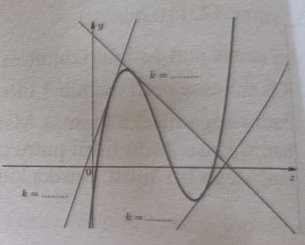

Tere! Väga tubli, et need ülesanded kokku kogusid. See on suurepärane ettevalmistus eksamiks. Matemaatika võib tunduda alguses hirmutav, aga kui me selle väikesteks tükkideks lammutame, on see täiesti tehtav. Oleme ausad – kõigil on oma nõrgad kohad, aga järjepidevus on see, mis ülikooli ukse avab.

Siin on lahendused koos "õpikulehekülgedega", mis aitavad reegleid meelde tuletada.

## Sisukord

* [Ülesanne 5: Avaldiste lihtsustamine ja väärtuse arvutamine](https://www.google.com/search?q=%23%C3%BClesanne-5)
* [Ülesanne 6: Funktsiooni tuletis ja puutuja]()
* [Ülesanne 7: Trigonomeetria ja kolmnurga arvutused]()
* [Ülesanne 9: Tekstülesanne ja võrrandisüsteem]()

---

## Ülesanne 5: Avaldiste lihtsustamine

1. Lihtsusta avaldised $A = \frac{3a^2 - 9ab}{a^2 - 2ab + b^2} : \left( \frac{a}{2a + 2b} - \frac{ab}{a^2 - b^2} \right)$ ja $B = 2(\sqrt{x} + 2)(\sqrt{x} - 2)$.
2. Arvuta avaldiste $A$ ja $B$ väärtused, kui $a = \log_3 81$, $b = 1,5^{-1}$ ja $x = 7,5$.

**1. Lihtsustame avaldise $A$:**
Kõigepealt tegurdame kõik osad, kus võimalik.
Lugejas $3a^2 - 9ab = 3a(a - 3b)$.
Nimetajas on ruutude vahe valem: $a^2 - 2ab + b^2 = (a - b)^2$.
Sulgudes olevad murrud: ühine nimetaja on $2(a - b)(a + b)$.

```math
A = \frac{3a(a-3b)}{(a-b)^2} : \left( \frac{a}{2(a+b)} - \frac{ab}{(a-b)(a+b)} \right)

```

```math
A = \frac{3a(a-3b)}{(a-b)^2} : \left( \frac{a(a-b) - 2ab}{2(a-b)(a+b)} \right) = \frac{3a(a-3b)}{(a-b)^2} \cdot \frac{2(a-b)(a+b)}{a^2 - ab - 2ab}

```

```math
A = \frac{3a(a-3b)}{(a-b)^2} \cdot \frac{2(a-b)(a+b)}{a(a-3b)} = \frac{6(a+b)}{a-b}

```

**Lihtsustame avaldise $B$:**
Kasutame ruutude vahe valemit $(x - y)(x + y) = x^2 - y^2$.

```math
B = 2(\sqrt{x} + 2)(\sqrt{x} - 2) = 2((\sqrt{x})^2 - 2^2) = 2(x - 4)

```

**2. Arvutame väärtused:**
Andmed: $a = \log_3 81 = 4$ (sest $3^4 = 81$); $b = 1,5^{-1} = (3/2)^{-1} = 2/3$; $x = 7,5$.

$A$ väärtus:

```math
A = \frac{6(4 + 2/3)}{4 - 2/3} = \frac{6 \cdot \frac{14}{3}}{\frac{10}{3}} = \frac{28}{\frac{10}{3}} = \frac{28 \cdot 3}{10} = 8,4

```

$B$ väärtus:

```math
B = 2(7,5 - 4) = 2 \cdot 3,5 = 7

```

---

### 📖 Abimees: Algebralised avaldised

* **Korrutamise abivalemid:**
* Ruutude vahe: $a^2 - b^2 = (a - b)(a + b)$
* Vahe ruut: $(a - b)^2 = a^2 - 2ab + b^2$


* **Logaritmi ja astme omadused:**
* $\log_a b = c \Rightarrow a^c = b$
* $a^{-n} = 1 / a^n$


* **Murdude jagamine:** Murru jagamiseks murruga korruta esimene murd teise murru pöördarvuga.

---

## Ülesanne 6: Funktsiooni tuletis ja puutuja

Joonisel on funktsiooni $f(x) = x^3 - 6x^2 + 9x - 1$ graafik ja kolm selle graafiku puutujat, mille tõusud on **-1**, **1,5** ja **3**.

1. Märkige iga puutuja juurde selle tõus.
2. Leidke funktsiooni $f(x)$:
* 1. tuletis;
* 2. kasvamis- ja kahanemisvahemikud.



**1. Puutujate tõusud joonisel:**
Tõus $k$ näitab, kui järsult sirge tõuseb või langeb.

* **Vasakpoolne puutuja** on kõige järsemalt tõusev: **$k = 3$**.
* **Keskmine puutuja** langeb: **$k = -1$**.
* **Parempoolne puutuja** on laugemalt tõusev: **$k = 1,5$**.

**2. Funktsiooni uurimine:**
Andmed: $f(x) = x^3 - 6x^2 + 9x - 1$.

1. **Tuletis:**

```math
f'(x) = 3x^2 - 12x + 9

```

2. **Kasvamis- ja kahanemisvahemikud:**
   Leiame kriitilised punktid, kus $f'(x) = 0$.
   $3x^2 - 12x + 9 = 0 \Rightarrow x^2 - 4x + 3 = 0$.
   Vieta valemitega saame lahendid $x_1 = 1$ ja $x_2 = 3$.

* Kasvab ($f'(x) > 0$): $x \in (-\infty; 1) \cup (3; \infty)$
* Kahaneb ($f'(x) < 0$): $x \in (1; 3)$

**3. Puutuja võrrand kohal $x_0 = 4$:**
Esmalt leiame puutepunkti $y$-koordinaadi:
$f(4) = 4^3 - 6 \cdot 4^2 + 9 \cdot 4 - 1 = 64 - 96 + 36 - 1 = 3$.
Nüüd leiame tõusu kohal $x = 4$ (tuletise väärtus):
$f'(4) = 3 \cdot 4^2 - 12 \cdot 4 + 9 = 48 - 48 + 9 = 9$.
Puutuja võrrand $y - y_0 = k(x - x_0)$:

```math
y - 3 = 9(x - 4) \Rightarrow y = 9x - 36 + 3 \Rightarrow y = 9x - 33

```

---

### 📖 Abimees: Tuletis ja puutuja

* **Tuletise reeglid:**
* $(x^n)' = n \cdot x^{n-1}$
* $(ax^n)' = a \cdot n \cdot x^{n-1}$
* Konstandi tuletis on 0.


* **Puutuja:** Puutuja tõus $k$ on võrdne funktsiooni tuletisega puutepunktis: $k = f'(x_0)$.
* **Kasvamine ja kahanemine:** Kui $f'(x) > 0$, siis funktsioon kasvab; kui $f'(x) < 0$, siis kahaneb.

---

## Ülesanne 7: Trigonomeetria

### **Ülesanne 7**

Aiamaa krunt on kolmnurgakujuline. Krundi külje $AB$ pikkus on **20 m**, külje $AC$ pikkus on **30 m** ja nende külgede vaheline nurk on **50°**.

1. Tehke tekstile vastav joonis.
2. Arvutage krundi ümbermõõt ja pindala.
3. Krundile on paigutatud kaks aiavalgustit. Üks neist asub tipus $A$ ja teine küljel $BC$ täpselt **9 m** kaugusel tipust $C$. Arvutage, kui kaugel asuvad valgustid teineteisest.

**1. Joonis:**
Joonesta kolmnurk $ABC$, kus nurk $A$ on 50°. Küljed $AB = 20$ m ja $AC = 30$ m.

**2. Ümbermõõt ja pindala:**
Leiame külje $BC$ (tähistame $a$) koosinusteoreemiga:

```math
a^2 = 20^2 + 30^2 - 2 \cdot 20 \cdot 30 \cdot \cos 50^\circ

```

$a^2 \approx 400 + 900 - 1200 \cdot 0,6428 \approx 528,64 \Rightarrow a \approx 22,99$ m.
Ümbermõõt $P = 20 + 30 + 22,99 = 72,99$ m.
Pindala $S$:

```math
S = \frac{1}{2} \cdot AB \cdot AC \cdot \sin 50^\circ = \frac{1}{2} \cdot 20 \cdot 30 \cdot 0,766 = 229,8\text{ m}^2

```

**3. Valgustite vaheline kaugus:**
Valgusti 1 on punktis $A$. Valgusti 2 on punktis $D$ küljel $BC$ nii, et $CD = 9$ m.
Kauguse $AD$ leidmiseks kolmnurgast $ADC$ vajame nurka $C$. Leiame selle siinusteoreemiga:
$\frac{\sin C}{20} = \frac{\sin 50^\circ}{22,99} \Rightarrow \sin C \approx \frac{20 \cdot 0,766}{22,99} \approx 0,6664 \Rightarrow C \approx 41,8^\circ$.
Nüüd leiame $AD$ koosinusteoreemiga kolmnurgas $ADC$:

```math
AD^2 = 30^2 + 9^2 - 2 \cdot 30 \cdot 9 \cdot \cos 41,8^\circ

```

$AD^2 \approx 900 + 81 - 540 \cdot 0,7455 \approx 578,43 \Rightarrow AD \approx 24,05$ m.

---

### 📖 Abimees: Trigonomeetria kolmnurgas

* **Koosinusteoreem:** $a^2 = b^2 + c^2 - 2bc \cos \alpha$ (kasuta kahe külje ja nendevahelise nurga puhul).
* **Siinusteoreem:** $\frac{a}{\sin A} = \frac{b}{\sin B} = \frac{c}{\sin C}$.
* **Kolmnurga pindala:** $S = \frac{1}{2} ab \sin \gamma$.

---

## Ülesanne 9: Elektripaketid ja võrrandisüsteem

### **Ülesanne 9**

Fikseeritud hinnaga elektripaketis on elektri ühe kilovatt-tunni (kWh) hind päevatariifi järgi **14 senti** ja öötariifi järgi **11 senti**. Selle paketi valinud majaomanikul tuli septembris maksta elektri eest **42,94 eurot** ja oktoobris **73,84 eurot**.

Septembris oli tema majapidamise päevane elektritarbimine **40 kWh** võrra väiksem kui oktoobris ja öine elektritarbimine **kaks korda väiksem** kui oktoobris.

Mitu kilovatt-tundi elektrit tarbis majaomanik kummaski kuus?

---

Olgu oktoobri päevane tarbimine $x$ kWh ja öine $y$ kWh.
Hinnad eurodes: päev 0,14 €/kWh ja öö 0,11 €/kWh.

**Oktoobri arve võrrand:**

```math
0,14x + 0,11y = 73,84

```

**Septembri tarbimised:**
Päev: $x - 40$
Öö: $0,5y$
**Septembri arve võrrand:**

```math
0,14(x - 40) + 0,11(0,5y) = 42,94 \Rightarrow 0,14x - 5,6 + 0,055y = 42,94 \Rightarrow 0,14x + 0,055y = 48,54

```

**Lahendame süsteemi, lahutades võrrandid:**
$(0,14x + 0,11y) - (0,14x + 0,055y) = 73,84 - 48,54$
$0,055y = 25,3 \Rightarrow y = 460$ kWh (oktoobri öine).
Leiame $x$:
$0,14x + 0,11 \cdot 460 = 73,84 \Rightarrow 0,14x + 50,6 = 73,84 \Rightarrow 0,14x = 23,24 \Rightarrow x = 166$ kWh (oktoobri päevane).

**Tulemused:**

* **Oktoober:** Päeval 166 kWh, öösel 460 kWh. Kokku **626 kWh**.
* **September:** Päeval $166 - 40 = 126$ kWh, öösel $460 / 2 = 230$ kWh. Kokku **356 kWh**.

---

### 📖 Abimees: Võrrandisüsteemid

* **Tekstülesande lahendamine:**
1. Vali tundmatud ($x$ ja $y$).
2. Pane kirja seosed (võrrandid) vastavalt tekstile.
3. Kasuta asendus- või liitmisvõtet.


* **Liitmisvõte:** Korruta võrrandeid nii, et ühe muutuja kordajad oleksid vastandarvud, ja liida võrrandid kokku, et see muutuja kaoks.

---


**Lühike vastus:** **Kolmnurga külg $BC$ on** \(a=\sqrt{400+900-1200\cos50^\circ}\approx 22{,}999\ \text{m}\). **Ümbermõõt** \(P\approx 73{,}000\ \text{m}\). **Pindala** \(S=\tfrac12\cdot20\cdot30\sin50^\circ\approx229{,}813\ \text{m}^2\). **Valgustite vaheline kaugus** \(AD\approx24{,}057\ \text{m}\).

> Dokumendist: *"Leiame külje $BC$ (tähistame $a$) koosinusteoreemiga: $a^2 = 20^2 + 30^2 - 2\cdot20\cdot30\cdot\cos 50^\circ$."*

---

### 1. Joonis (SVG)
```svg
<svg xmlns="http://www.w3.org/2000/svg" width="420" height="320" viewBox="-5 -5 45 35">
  <style>text{font:10px sans-serif}</style>
  <!-- punktide koordinaadid (m): A=(0,0), B=(20,0), C=(19.2836,22.9813), D˜(19.5641,13.9857) -->
  <polygon points="0,0 20,0 19.2836,22.9813" fill="none" stroke="#000" stroke-width="0.2"/>
  <circle cx="0" cy="0" r="0.3" fill="#000"/><text x="0.6" y="0.6">A</text>
  <circle cx="20" cy="0" r="0.3" fill="#000"/><text x="20.6" y="0.6">B</text>
  <circle cx="19.2836" cy="22.9813" r="0.3" fill="#000"/><text x="19.9" y="23.6">C</text>
  <circle cx="19.5641" cy="13.9857" r="0.25" fill="#f00"/><text x="19.9" y="14.3" fill="#f00">D</text>
  <!-- mõõdud -->
  <line x1="0" y1="0" x2="20" y2="0" stroke="#00f" stroke-width="0.1"/><text x="9" y="-0.8" fill="#00f">AB=20</text>
  <line x1="0" y1="0" x2="19.2836" y2="22.9813" stroke="#00f" stroke-width="0.1"/><text x="8" y="12" fill="#00f">AC=30</text>
  <line x1="20" y1="0" x2="19.2836" y2="22.9813" stroke="#00f" stroke-width="0.1"/><text x="19" y="11" fill="#00f">BC˜22.999</text>
</svg>
```


---

### 2. Arvutused ja täpsemad väljendid
**Külje \(BC\) leidmine (koosinusteoreem):**
```math
a^2 = 20^2 + 30^2 - 2\cdot20\cdot30\cos50^\circ
```
Seega
```math
a=\sqrt{1300-1200\cos50^\circ}\approx22{,}999021\ \text{m}.
```

**Ümbermõõt:**
```math
P=20+30+a\approx72{,}999021\ \text{m}\approx73{,}000\ \text{m}.
```

**Pindala (SAS-formel):**
```math
S=\tfrac12\cdot AB\cdot AC\cdot\sin50^\circ=\tfrac12\cdot20\cdot30\sin50^\circ
```
```math
S=300\sin50^\circ\approx229{,}813\ \text{m}^2.
```

---

### 3. Valgustite vahe (punktid A ja D, kus \(CD=9\))
Esmalt leiame nurga \(C\) (Law of Sines):
```math
\frac{\sin C}{AB}=\frac{\sin50^\circ}{a}\quad\Rightarrow\quad
\sin C=\frac{20\sin50^\circ}{a}\approx0{,}666556
```
```math
C\approx\arcsin(0{,}666556)\approx41{,}810^\circ.
```
Seejärel kolmnurgas \(ADC\) (küljed \(AC=30\), \(CD=9\), nurk \(\angle C\)):
```math
AD^2=30^2+9^2-2\cdot30\cdot9\cos C
```
```math
AD=\sqrt{981-540\cos C}\approx24{,}057\ \text{m}.
```

---

### Õpiku lehekülg (vajalikud valemid ja näpunäited)
- **Koosinusteoreem:** \(c^2=a^2+b^2-2ab\cos\gamma\).
- **Siinusteoreem:** \(\dfrac{a}{\sin A}=\dfrac{b}{\sin B}=\dfrac{c}{\sin C}\).
- **Pindala (SAS):** \(S=\tfrac12 ab\sin\gamma\).
- **Heroni valem (kui on 3 külge):** \(S=\sqrt{s(s-a)(s-b)(s-c)}\), kus \(s=\tfrac{a+b+c}{2}\).
- **Näpunäide eksamiks:** kirjuta alati ära, millist teoreemi kasutad, too välja täpsed algebrailised väljendid (näiteks \(a=\sqrt{1300-1200\cos50^\circ}\)) ja alles seejärel arvuta numbriliselt; see annab punkte ka siis, kui kalkulaatori viimased numbrid veidi erinevad.
- 