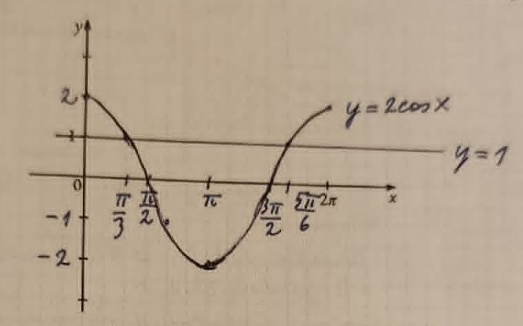

## Ülesanne 6 — Kontroll ja lahendus

---

### Osa 1: Lihtsusta avaldis

```math
\sin\!\left(\frac{\pi}{2}-x\right)+\cos^2\!\frac{2\pi}{3}-\cos(\pi+x)+\sin^2\!\frac{2\pi}{3}
```

**Lahendus — samm-sammult:**

Kasutame kolme valemit (vt allpool „Valemileht"):

- $\sin\!\left(\dfrac{\pi}{2}-x\right) = \cos x$

- $-\cos(\pi+x) = -(-\cos x) = \cos x$

- $\cos^2\!\dfrac{2\pi}{3}+\sin^2\!\dfrac{2\pi}{3} = 1$

Asendame:

```math
= \cos x + \underbrace{\cos^2\!\tfrac{2\pi}{3}+\sin^2\!\tfrac{2\pi}{3}}_{=\,1} + \cos x = \boxed{1 + 2\cos x}
```

---

### Osa 2: Lahenda võrrand ja võrratus

**Võrrand** $2\cos x = 1$, kus $x \in [0;\, 2\pi]$

```math
\cos x = \frac{1}{2}
```

```math
x = \pm\arccos\frac{1}{2} + 2n\pi, \quad n \in \mathbb{Z}
```

```math
x = \pm\frac{\pi}{3} + 2n\pi, \quad n \in \mathbb{Z}
```

Lõigule $[0;\,2\pi]$ kuuluvad lahendid:

```math
x_1 = \frac{\pi}{3}, \qquad x_2 = \frac{5\pi}{3}
```

**Võrratus** $2\cos x < 1$, kus $x \in [0;\, 2\pi]$

Graafikult on näha, et $y = 2\cos x$ jääb joone $y = 1$ alla vahemikus:

```math
x \in \left(\frac{\pi}{3};\;\frac{5\pi}{3}\right)
```



---
---

## ?? Valemileht — Eksamiks vajalik

### 1. Põhisamasus (kõige tähtsam!)

```math
\sin^2 x + \cos^2 x = 1
```

> Kehtib **iga** $x$ korral. Kui näed $\sin^2$ ja $\cos^2$ koos — liida kokku, saad 1.

---

### 2. Taandamisvalemid (reduktsioonivalemid)

Need muudavad „keerulised" nurgad lihtsaks:

```math
\sin\!\left(\frac{\pi}{2} - x\right) = \cos x
```

```math
\cos\!\left(\frac{\pi}{2} - x\right) = \sin x
```

```math
\sin(\pi - x) = \sin x
```

```math
\cos(\pi - x) = -\cos x
```

```math
\sin(\pi + x) = -\sin x
```

```math
\cos(\pi + x) = -\cos x
```

```math
\sin(-x) = -\sin x \qquad \cos(-x) = \cos x
```

> **Reegel pähkel:** $\dfrac{\pi}{2} \pm x$ puhul funktsioon **vahetub** (sin?cos). $\pi \pm x$ ja $2\pi \pm x$ puhul funktsioon **ei vahetu**, ainult märk võib muutuda.

---

### 3. Koosinusvõrrandi üldlahend

```math
\cos x = a \implies x = \pm\arccos a + 2n\pi, \quad n \in \mathbb{Z}
```

Tähtsamad väärtused peast:

| $\cos x$ | $x$ (I veerand) |
|---|---|
| $1$ | $0$ |
| $\dfrac{\sqrt{3}}{2}$ | $\dfrac{\pi}{6}$ |
| $\dfrac{\sqrt{2}}{2}$ | $\dfrac{\pi}{4}$ |
| $\dfrac{1}{2}$ | $\dfrac{\pi}{3}$ |
| $0$ | $\dfrac{\pi}{2}$ |

> Koosinusel on **kaks** lahendit perioodil $[0; 2\pi]$: $x_1$ ja $x_2 = 2\pi - x_1$ (sümmetriliselt).

---

### 4. Koosinusvõrratuse lahendamine graafikult

Võrratuse $\cos x < a$ lahendamiseks:
1. Joonesta $y = \cos x$ ja horisontaaljoon $y = a$
2. Leia lõikepunktid (need on võrrandi $\cos x = a$ lahendid)
3. Vasta on see **vahemik**, kus graafik jääb joone $y = a$ **alla**

```math
2\cos x < 1 \implies \cos x < \frac{1}{2} \implies x \in \left(\frac{\pi}{3};\, \frac{5\pi}{3}\right) \text{ lõigul } [0;\, 2\pi]
```

> **Märkus:** Kui võrratus on $<$ või $>$, siis lõikepunktid **ei kuulu** lahendihulka (kasutame ümarsulge). Kui $\leq$ või $\geq$, siis **kuuluvad** (kantsulg).
