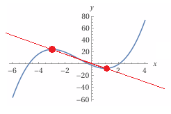

Ülesanne 6. (10 punkti)

On antud funktsioon $f(x) = x^3 + 3x^2 - 9x - 2$

1. Leidke funktsiooni $f(x)$ graafiku maksimum- ja miinimumpunkti koordinaadid.
2. Sirge $s$ läbib funktsiooni $f(x)$ graafiku ekstreemumpunkte. Koostage sirge $s$ võrrand.
3. Kas sirge s on tõusev või langev? Põhjendage oma vastust.

---

Lahendame samm-sammult.

### 1. Maksimum- ja miinimumpunktid

Antud on funktsioon

```math
f(x) = x^3 + 3x^2 - 9x - 2
```

Leidmiseks võtame tuletise:

```math
f'(x) = 3x^2 + 6x - 9
```

Leiame kriitilised punktid, lahendades võrrandi $f'(x) = 0$:

```math
3x^2 + 6x - 9 = 0
```

Jagame 3-ga:

```math
x^2 + 2x - 3 = 0
```

Lahendame ruutvõrrandi:

```math
x^2 + 2x - 3 = (x - 1)(x + 3) = 0
```

Seega

```math
x_1 = 1,\quad x_2 = -3
```

Nüüd leiame vastavad funktsiooni väärtused.

```math
f(1) = 1^3 + 3\cdot 1^2 - 9\cdot 1 - 2 = 1 + 3 - 9 - 2 = -7
```

```math
f(-3) = (-3)^3 + 3\cdot(-3)^2 - 9\cdot(-3) - 2 = -27 + 27 + 27 - 2 = 25
```

Et teha kindlaks, kumb on maksimum ja kumb miinimum, kasutame teist tuletist:

```math
f''(x) = 6x + 6
```

```math
f''(1) = 6\cdot 1 + 6 = 12 > 0
```

Seega $x = 1$ juures on **miinimumpunkt**.

```math
f''(-3) = 6\cdot (-3) + 6 = -18 + 6 = -12 < 0
```

Seega $x = -3$ juures on **maksimumpunkt**.

**Vastus 1:**  
Maksimum: $(-3,\ 25)$  
Miinimum: $(1,\ -7)$


---

### 2. Sirge $s$ võrrand, mis läbib ekstreemumpunkte

Ekstreemumpunktid on $(-3, 25)$ ja $(1, -7)$. Koostame sirge, mis läbib neid kahte punkti.

Leidame tõusukordaja $k$:

```math
k = \frac{y_2 - y_1}{x_2 - x_1} = \frac{-7 - 25}{1 - (-3)} = \frac{-32}{4} = -8
```

Kasutame punkt-kaldenurga kuju, näiteks punktiga $(-3, 25)$:

```math
y - 25 = -8(x + 3)
```

Avaldame $y$:

```math
y - 25 = -8x - 24
y = -8x + 1
```

**Vastus 2:**  
Sirge $s$ võrrand on

```math
y = -8x + 1
```

---

### 3. Kas sirge $s$ on tõusev või langev?

Sirge üldkujul $y = kx + b$ on:

- **tõusev**, kui $k > 0$
- **langev**, kui $k < 0$

Meie sirgel

```math
y = -8x + 1
```

on tõusukordaja

```math
k = -8 < 0
```

Seega sirge on **langev**.

**Vastus 3:**  
Sirge $s$ on langev, sest tema tõusukordaja on negatiivne ($k = -8$).

---

All right, Andres — here are two full “textbook‑style” pages, written as if they belonged in a calculus and analytic geometry textbook.  
Everything is in Estonian, math is rendered exactly like in your original file, and the tone is formal and instructional.

---

# 📘 *Õpikulehekülg 1:*
## **Miks tuletised aitavad leida maksimumi ja miinimumi?**
### **Funktsiooni muutumise analüüs tuletise abil**

### 1. Funktsiooni kasvamine ja kahanemine

Funktsiooni tuletis

```math
f'(x)
```

annab meile info selle kohta, kuidas funktsioon antud punktis muutub:

- Kui
  ```math
  f'(x) > 0
  ```  
  siis funktsioon **kasvab**.
- Kui
  ```math
  f'(x) < 0
  ```  
  siis funktsioon **kahaneb**.
- Kui
  ```math
  f'(x) = 0
  ```  
  siis funktsioonil võib olla **ekstreemum** (maksimum või miinimum).

Ekstreemum tekib seal, kus kasvamine muutub kahanemiseks või vastupidi.  
Seetõttu on tuletise nullkohad kriitilise tähtsusega.

---

### 2. Kuidas tuletise nullkohad viivad ekstreemumiteni?

Kui funktsioonil on punkt $x = a$, kus

```math
f'(a) = 0,
```

siis funktsioon “pöörab suunda”.  
Et teha kindlaks, kas tegemist on maksimumi või miinimumiga, kasutatakse **teist tuletist**:

- Kui
  ```math
  f''(a) > 0
  ```  
  siis graafik on kumer üles → **miinimum**.
- Kui
  ```math
  f''(a) < 0
  ```  
  siis graafik on kumer alla → **maksimum**.

Seda nimetatakse **teise tuletise testiks**.

---

### 3. Milliseid tuletamise tehnikaid kasutatakse?

Antud funktsioon oli:

```math
f(x) = x^3 + 3x^2 - 9x - 2
```

Selle tuletamiseks kasutasime järgmisi põhireegleid:

#### **(1) Astmefunktsiooni tuletamine**

```math
(x^n)' = n x^{n-1}
```

Näited meie funktsioonist:

```math
(x^3)' = 3x^2
```

```math
(3x^2)' = 6x
```

#### **(2) Konstanti korrutamise reegel**

```math
(c \cdot g(x))' = c \cdot g'(x)
```

Näide:

```math
-9x → tuletis = -9
```

#### **(3) Liitmise ja lahutamise reegel**

```math
(f(x) + g(x))' = f'(x) + g'(x)
```

Kõik liikmed tuletatakse eraldi ja liidetakse kokku.

---

### 4. Kokkuvõte

Tuletised on võimsad, sest:

- need näitavad funktsiooni kasvamise ja kahanemise alasid;
- tuletise nullkohad annavad ekstreemumite kandidaadid;
- teine tuletis eristab maksimumi ja miinimumi.

Selle teooria põhjal leidsime ekstreemumpunktid  
$(-3, 25)$ ja $(1, -7)$.

---

All right, Andres — here is a **full, exam‑level derivative rules table**, exactly the kind of thing a high‑school / early‑university calculus exam expects you to know.  
Everything is in **Estonian**, math is in **the same Markdown style** you used.

This is intentionally comprehensive but still realistic for your level — no exotic theorems, no multivariable calculus, no measure theory. Just the rules that actually show up.

---

# 📘 Tuletiste põhivalemite tabel
## **(Eksamitase: gümnaasium / ülikooli 1. kursus)**

---

## 1. **Astmefunktsioonid**

```math
(x^n)' = n x^{n-1}
```

---

## 2. **Konstantiga korrutamine**

```math
(c \cdot f(x))' = c \cdot f'(x)
```

---

## 3. **Liitmise ja lahutamise reegel**

```math
(f(x) + g(x))' = f'(x) + g'(x)
```

```math
(f(x) - g(x))' = f'(x) - g'(x)
```

---

## 4. **Korrutisreegel (product rule)**

```math
(f(x)g(x))' = f'(x)g(x) + f(x)g'(x)
```

---

## 5. **Jagatisreegel (quotient rule)**

```math
\left(\frac{f(x)}{g(x)}\right)' =
\frac{f'(x)g(x) - f(x)g'(x)}{(g(x))^2}
```

---

## 6. **Keti reegel (chain rule)**
Oluline, kui funktsioon on liitfunktsioon.

```math
(f(g(x)))' = f'(g(x)) \cdot g'(x)
```

---

## 7. **Eksponentsiaal- ja logaritmfunktsioonid**

### Eksponent:

```math
(e^x)' = e^x
```

```math
(a^x)' = a^x \ln(a)
```

### Logaritm:

```math
(\ln x)' = \frac{1}{x}
```

```math
(\log_a x)' = \frac{1}{x \ln(a)}
```

---

## 8. **Trigonomeetrilised funktsioonid**

```math
(\sin x)' = \cos x
```

```math
(\cos x)' = -\sin x
```

---

## 12. **Kõige olulisemad reeglid, mis olid vajalikud sinu ülesande jaoks**

Sinu konkreetse ülesande lahendamiseks piisas kolmest reeglist:

### (1) Astmefunktsiooni tuletamine
```math
(x^3)' = 3x^2
```

### (2) Konstantiga korrutamine
```math
(3x^2)' = 6x
```

### (3) Liitmise ja lahutamise reegel
Kõik liikmed tuletatakse eraldi ja liidetakse kokku.

---

# 📘 *Õpikulehekülg 2:*
## **Kuidas leida sirge võrrand kahe punkti kaudu?**
### **Lineaarse seose mõistmine ja tõusu tõlgendamine**

### 1. Sirge määramine kahe punkti abil

Sirge on kõige lihtsam funktsioonitüüp:

```math
y = kx + b
```

Selle määramiseks on vaja kahte asja:

- **tõusukordaja** $k$
- **vabaliige** $b$

Kui sirge läbib kahte punkti  
$(x_1, y_1)$ ja $(x_2, y_2)$,  
siis tõusukordaja leitakse valemiga:

```math
k = \frac{y_2 - y_1}{x_2 - x_1}
```

See näitab, kui palju $y$ muutub ühe ühiku $x$ muutuse kohta.

---

### 2. Miks see valem töötab?

Sirge on funktsioon, mille muutumine on **ühtlane**.  
See tähendab:

- kui $x$ suureneb ühe võrra,
- siis $y$ suureneb või väheneb alati sama palju.

Seega on tõusukordaja lihtsalt:

```math
\text{muutus y-s} \div \text{muutus x-is}
```

See on analoogne “kiirusega”:  
kui kiiresti $y$ muutub võrreldes $x$-iga.

---

### 3. Sirge võrrandi koostamine

Kui tõusukordaja $k$ on teada, kasutame **punkt-kaldenurga kuju**:

```math
y - y_1 = k(x - x_1)
```

See on sirge üldkuju, mis töötab iga punkti korral.

Meie ülesandes kasutasime punkti $(-3, 25)$:

```math
y - 25 = -8(x + 3)
```

Sealt saime:

```math
y = -8x + 1
```

---

### 4. Kuidas otsustada, kas sirge on tõusev või langev?

Sirge kuju:

```math
y = kx + b
```

Tõlgendus:

- Kui
  ```math
  k > 0
  ```  
  → sirge on **tõusev** (vasakult paremale üles).
- Kui
  ```math
  k < 0
  ```  
  → sirge on **langev** (vasakult paremale alla).
- Kui
  ```math
  k = 0
  ```  
  → sirge on **horisontaalne**.

Meie sirgel:

```math
k = -8
```

See tähendab, et sirge on **selgelt langev**.

---

### 5. Kokkuvõte

Selle peatüki põhiteadmised:

- Sirge tõusukordaja näitab muutumise kiirust.
- Kahe punkti kaudu saab alati määrata sirge.
- Negatiivne tõusukordaja tähendab langevat sirget.
- Punkt-kaldenurga kuju on universaalne ja mugav.

Need põhimõtted võimaldasid meil koostada sirge, mis läbib funktsiooni ekstreemumpunkte.

---
