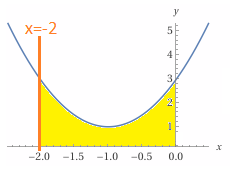

Ülesanne 8. (10 punkti)

On antud funktsioon $f(x) = 2x^2 + 4x + 3$

1. Arvutage funktsiooni $f(x)$ graafiku haripunkti koordinaadid.
2. Joonestage koordinaatteljestikku funktsiooni $f(x)$ graafik ja sirge $x = –2$.
3. Viirutage kõvertrapets, mida piiravad funktsiooni graafik, sirge $x = –2$, x-telg ja y-telg, ning arvutage selle kõvertrapetsi pindala täpne väärtus.

---

### Ülesanne 8 – lahendus

Antud on funktsioon

```math
f(x) = 2x^2 + 4x + 3
```

---

#### 1. Haripunkti koordinaadid

Võtame tuletise:

```math
f'(x) = 4x + 4
```

Leiame kriitilise punkti:

```math
4x + 4 = 0 \Rightarrow x = -1
```

Arvutame vastava funktsiooni väärtuse:

```math
f(-1) = 2\cdot(-1)^2 + 4\cdot(-1) + 3 = 2 - 4 + 3 = 1
```

Seega haripunkt (parabooli tipp) on

```math
(-1,\ 1)
```

---

#### 2. Graafiku ja sirge joonestamine

- Funktsioon \(f(x) = 2x^2 + 4x + 3\) on **parabool**, mis avaneb ülespoole (sest \(2 > 0\)).
- Haripunkt on \((-1, 1)\).
- Leiame veel paar punkti:

  ```math
  f(-2) = 2\cdot 4 + 4\cdot(-2) + 3 = 8 - 8 + 3 = 3
  ```
  ```math
  f(0) = 3
  ```

- Sirge \(x = -2\) on **vertikaalne sirge**, mis läbib punkti \((-2, 0)\) ja \((-2, 3)\).

Joonestamisel:
- märgid koordinaatteljestiku,
- joonistad parabooli tippuga \((-1, 1)\), punktidega \((-2, 3)\) ja \((0, 3)\),
- lisad vertikaalse sirge \(x = -2\).

---

#### 3. Kõvertrapetsi pindala

Kõvertrapetsit piiravad:
- funktsiooni graafik \(y = f(x)\),
- sirge \(x = -2\),
- x-telg \(y = 0\),
- y-telg \(x = 0\).

See tähendab, et vaatleme ala **vahemikus**:

```math
x \in [-2, 0]
```



Funktsioon on selles vahemikus **positiivne** (väärtused 1 kuni 3), seega pindala on:

```math
S = \int_{-2}^{0} f(x)\,dx = \int_{-2}^{0} (2x^2 + 4x + 3)\,dx
```

Integreerime:

```math
\int (2x^2 + 4x + 3)\,dx
= \frac{2}{3}x^3 + 2x^2 + 3x
```

Arvutame määratud integraali:

```math
S = \left[\frac{2}{3}x^3 + 2x^2 + 3x\right]_{-2}^{0}
```

```math
S = \left(\frac{2}{3}\cdot 0^3 + 2\cdot 0^2 + 3\cdot 0\right)
 - \left(\frac{2}{3}\cdot(-2)^3 + 2\cdot(-2)^2 + 3\cdot(-2)\right)
```

```math
S = 0 - \left(\frac{2}{3}\cdot(-8) + 2\cdot 4 - 6\right)
= 0 - \left(-\frac{16}{3} + 8 - 6\right)
```

```math
= 0 - \left(-\frac{16}{3} + 2\right)
= 0 - \left(-\frac{16}{3} + \frac{6}{3}\right)
= 0 - \left(-\frac{10}{3}\right)
= \frac{10}{3}
```

**Vastus:** kõvertrapetsi pindala on

```math
S = \frac{10}{3}
```


---

## 📘 Õpikulehekülg: ruutfunktsiooni haripunkt ja kõvertrapetsi pindala

### 1. Ruutfunktsiooni kuju ja haripunkt

Üldine ruutfunktsioon on kujul

```math
f(x) = ax^2 + bx + c,\quad a \neq 0
```

Selle graafik on **parabool**.

- Kui \(a > 0\) → parabool avaneb **ülespoole** (haripunkt on **miinimum**).
- Kui \(a < 0\) → parabool avaneb **allapoole** (haripunkt on **maksimum**).

#### Haripunkti leidmine tuletise abil

Tuletis:

```math
f'(x) = 2ax + b
```

Haripunkti x-koordinaat leitakse võrrandist:

```math
f'(x) = 0 \Rightarrow 2ax + b = 0 \Rightarrow x = -\frac{b}{2a}
```

Seega:

```math
x_{\text{haripunkt}} = -\frac{b}{2a}
```

y-koordinaat:

```math
y_{\text{haripunkt}} = f\left(-\frac{b}{2a}\right)
```

Meie funktsiooni puhul:

```math
f(x) = 2x^2 + 4x + 3
```

siin \(a = 2\), \(b = 4\), \(c = 3\).  
Valemiga:

```math
x_{\text{haripunkt}} = -\frac{4}{2\cdot 2} = -1
```

ja

```math
y_{\text{haripunkt}} = f(-1) = 1
```

---

### 2. Sirge \(x = k\) ja koordinaatteljestik

Sirge

```math
x = k
```

on **vertikaalne sirge**, mis läbib kõiki punkte, mille x-koordinaat on \(k\).

Meie näites:

```math
x = -2
```

on vertikaalne sirge, mis lõikab:
- x-telge punktis \((-2, 0)\),
- parabooli punktis \((-2, f(-2)) = (-2, 3)\).

---

### 3. Kõvertrapets ja pindala kui integraal

Kõvertrapets on tasandiline kujund, mida piiravad:
- funktsiooni graafik \(y = f(x)\),
- kaks vertikaalset sirget \(x = a\) ja \(x = b\),
- x-telg \(y = 0\).

Kui funktsioon on vahemikus \([a, b]\) **mitte-negatiivne**, siis kõvertrapetsi pindala on:

```math
S = \int_a^b f(x)\,dx
```

Meie ülesandes:
- vasak piir: sirge \(x = -2\),
- parem piir: y-telg \(x = 0\),
- ülemine piir: parabool \(y = f(x)\),
- alumine piir: x-telg \(y = 0\).

Seega:

```math
S = \int_{-2}^{0} (2x^2 + 4x + 3)\,dx
```

---

### 4. Integreerimise põhireeglid, mida kasutasime

Kui

```math
F'(x) = f(x),
```

siis määratud integraal

```math
\int_a^b f(x)\,dx = F(b) - F(a)
```

Antud funktsiooni korral:

```math
f(x) = 2x^2 + 4x + 3
```

Integreerime liikmete kaupa:

- Astmefunktsioon:

```math
\int x^n\,dx = \frac{x^{n+1}}{n+1} + C,\quad n \neq -1
```

- Rakendame:

```math
\int 2x^2\,dx = 2\cdot \frac{x^3}{3} = \frac{2}{3}x^3
```

```math
\int 4x\,dx = 4\cdot \frac{x^2}{2} = 2x^2
```

```math
\int 3\,dx = 3x
```

Seega algfunktsioon on:

```math
F(x) = \frac{2}{3}x^3 + 2x^2 + 3x
```

ja pindala:

```math
S = F(0) - F(-2) = \frac{10}{3}
```

---
